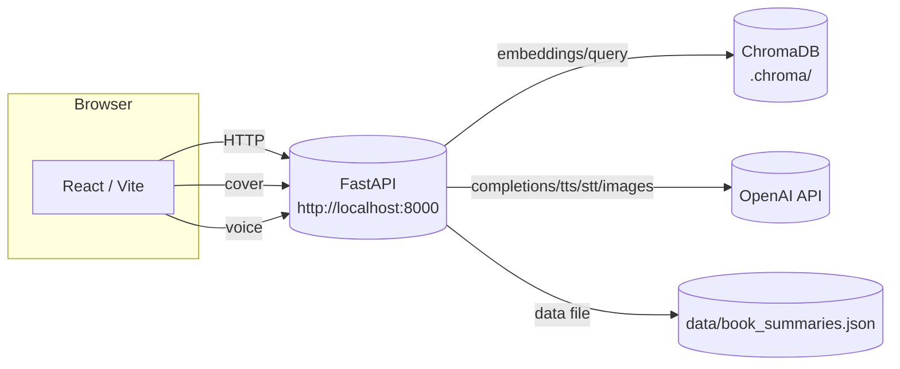

# Smart Librarian

AI book‑recommendation chatbot powered by **OpenAI GPT + RAG (ChromaDB)** with a **React (Vite)** frontend and **FastAPI** backend. It semantically retrieves candidate books, lets a chat model choose **one** title with a short blurb, and attaches a detailed summary via a tool call. Optional **Text‑to‑Speech**, **Speech‑to‑Text**, and **cover generation** are included.

---

## Dependency Graph


---

## Prerequisites

- **Python 3.10+**
- **Node 18+** and **npm**
- **OpenAI API key**

> Do **not** commit secrets. Use a local `.env` file (ignored by Git).

---

## Run the Backend (FastAPI)

```powershell
cd src/backend
python -m venv .venv
. .venv/Scripts/Activate.ps1   # (bash: source .venv/bin/activate)
pip install -r requirements.txt
```

Create `src/backend/.env` (example):

```dotenv
OPENAI_API_KEY=sk-...

# optional overrides
CHAT_MODEL=gpt-4o-mini
EMBED_MODEL=text-embedding-3-small
TRANSCRIBE_MODEL=whisper-1
TTS_MODEL=gpt-4o-mini-tts
IMAGE_MODEL=gpt-image-1
IMAGE_SIZE=1024x1024          # 1024x1024 | 1024x1536 | 1536x1024 | auto
IMAGE_RETURN_PX=512           # downscale on return (0 = original)
IMAGE_OUTPUT_FORMAT=webp      # webp | png
IMAGE_WEBP_QUALITY=72
RATE_LIMIT_PER_MIN=30
```

Start the API (port **8000**):

```powershell
python -m uvicorn --app-dir src backend.main:app --reload --port 8000
```

(After editing the dataset, reindex the vector DB)

---

## Run the Frontend (React + Vite)

```powershell
cd src/frontend
npm install
npm run dev
```

Open **http://localhost:5173**.

---

## How It Works

1. UI sends `POST /recommend` with the natural‑language query.
2. Backend retrieves top‑K candidates from **ChromaDB** using OpenAI embeddings, prompts the chat model to pick **one** title, and writes a short, friendly blurb.
3. Backend attaches the canonical `detailed_summary` from the dataset (tool call).
4. UI renders the pick + candidates and optionally asks `/cover/img` for an illustrative book cover (cached on disk).
5. **Listen** (TTS) and **Voice** (STT) are available as optional features.

---

## API (selected)

### Health
```http
GET /health
```

### Reindex
```http
POST /admin/reindex
```

### Recommend
```http
POST /recommend
Content-Type: application/json

{ "query": "friendship and magic" }
```

**Response (shape)**:
```json
{
  "query": "friendship and magic",
  "title": "The Hobbit",
  "reason": "Short assistant blurb about why this fits the query.",
  "detailed_summary": "...",
  "metadata": {
    "title": "The Hobbit",
    "author": "J.R.R. Tolkien",
    "genres": ["Fantasy","Adventure"],
    "themes": ["friendship","courage"],
    "year": 1937
  },
  "candidates": [ /* top-K */ ]
}
```

### Summary by Title
```http
GET /summary?title=The%20Hobbit
```

### Optional
- **TTS**: `POST /tts` (JSON: `{ "text": "...", "voice": "alloy" }`) → MP3
- **STT**: `POST /stt` (multipart `file`) → `{ "text": "..." }`
- **Cover image**: `GET /cover/img?title=The%20Hobbit&fmt=webp&size=auto` → image

---

## Project Structure

```
smartlibrarian/
├─ src/
│  ├─ backend/
│  │  ├─ data/
│  │  │  └─ book_summaries.json
│  │  ├─ .chroma/                 # ChromaDB store (created at runtime)
│  │  ├─ main.py                  # FastAPI app (RAG, tools, TTS/STT, cover)
│  │  ├─ rag_pipeline.py          # retrieval + LLM selection
│  │  ├─ db.py                    # Chroma client & indexing
│  │  ├─ tools.py                 # get_summary_by_title
│  │  ├─ safety.py                # moderation & simple rules
│  │  ├─ rate_limit.py            # per-IP limiter
│  │  └─ config.py                # env & defaults
│  └─ frontend/
│     ├─ src/
│     │  ├─ App.jsx
│     │  ├─ api.js
│     │  └─ components/BookCard.jsx
│     └─ vite.config.js
├─ .gitignore
└─ README.md
```

---

## Configuration (backend)

| Variable | Default | Notes |
|---|---|---|
| `OPENAI_API_KEY` | — | Required for all model calls. |
| `CHAT_MODEL` | `gpt-4o-mini` | Chat model used to pick the book and write a blurb. |
| `EMBED_MODEL` | `text-embedding-3-small` | For ChromaDB semantic search. |
| `TRANSCRIBE_MODEL` | `whisper-1` | STT model for `/stt`. |
| `TTS_MODEL` | `gpt-4o-mini-tts` | TTS model for `/tts`. |
| `IMAGE_MODEL` | `gpt-image-1` | Used by `/cover/img`. |
| `IMAGE_SIZE` | `1024x1024` | One of `1024x1024`, `1024x1536`, `1536x1024`, `auto`. |
| `IMAGE_RETURN_PX` | `512` | Downscale on return to improve load time. |
| `IMAGE_OUTPUT_FORMAT` | `webp` | `webp` (small) or `png`. |
| `IMAGE_WEBP_QUALITY` | `72` | If `webp` selected. |
| `RATE_LIMIT_PER_MIN` | `30` | Per‑IP limiter for `/recommend`. |

---

## Common Commands

```powershell
# (re)create venv + install
cd src/backend; python -m venv .venv; .venv/Scripts/Activate pip install -r requirements.txt

# run API
python -m uvicorn --app-dir src backend.main:app --reload --port 8000

# reindex after editing dataset
curl -X POST http://127.0.0.1:8000/admin/reindex

# run frontend
cd ../../frontend; npm install; npm run dev
```

---

## Troubleshooting

- **UI shows “Failed to fetch”** → ensure API at `http://127.0.0.1:8000` and CORS origin `http://localhost:5173` is allowed.  
- **429 Too Many Requests** → rate‑limit reached; wait 60s or lower `RATE_LIMIT_PER_MIN`.  
- **Image slow on first load** → first render is model latency; later loads are cached and downscaled to `IMAGE_RETURN_PX`.  
- **No TTS audio** → verify `TTS_MODEL` and keep text under ~4k chars.  
- **Empty STT result** → keep recordings short (~15s) and use webm/mp4/wav.
